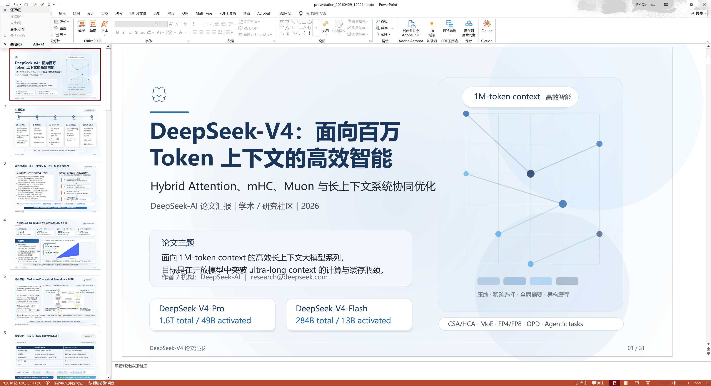

# Paper PPT Agent

<p align="center">
  <b>上传论文，AI 自动生成演示文稿</b>
</p>

<p align="center">
  <a href="https://github.com/CRui5in/paper-ppt-agent/blob/master/LICENSE"></a>
  
  
  
  
  
</p>

<p align="center">
  中文 | <a href="./README.en.md">English</a>
</p>

---

基于多智能体协作的学术论文演示文稿自动生成工具。上传论文 PDF 或 TeX 源码，由 AI 完成内容提炼、结构规划、版式设计与视觉质量审查，最终输出可编辑的 PowerPoint 文件。


## 目录

- [✨ 功能亮点](#-功能亮点)
- [📸 效果展示](#-效果展示)
- [⚙️ 环境要求](#️-环境要求)
- [🚀 快速开始](#-快速开始)
- [📋 更新日志](#-更新日志)
- [🗺️ 开发计划](#️-开发计划)
- [🙏 参考项目](#-参考项目)
- [📄 许可证](#-许可证)

---

## ✨ 功能亮点

| 功能 | 说明 |
|:-----|:-----|
| **多智能体流水线** | Strategist → Executor → Critic 三阶段协作，内容提炼与版式生成一体化 |
| **静态 + 视觉 QA** | 自动检测文字溢出、元素重叠、低对比度等问题并触发修复 |
| **图标语义匹配** | 基于 Gemini Embedding 的 RAG 语义搜索，自动匹配最合适的图标 |
| **反馈迭代** | 指定单页或全量重生成，支持结构调整（增删插排），自动版本快照 |
| **实时可观测** | Agent 日志流、Token 用量聚合、Critic 逐页详情面板 |
| **多语言** | 支持中英双语及自定义语言输出 |
| **多模型** | OpenAI / Anthropic / Gemini / DeepSeek 及自定义兼容接口 |
| **模板系统** | 预设多种行业风格模板，支持自定义模板导入与字体配置 |
| **Deep Research** | 外部研究增强（arXiv / Semantic Scholar / Web），相关性自动过滤 |

## 📸 效果展示

<p align="center">
  
</p>

## ⚙️ 环境要求

| 依赖 | 版本 |
|:-----|:-----|
| 🐍 Python | 3.11+ |
| 📦 [uv](https://docs.astral.sh/uv/) | latest |
| 🟢 Node.js | 18+ |

至少一种模型提供商的 API Key：OpenAI / Anthropic / Gemini / DeepSeek 或自定义 BaseURL 兼容接口。

## 🚀 快速开始

```bash
# 克隆仓库
git clone https://github.com/CRui5in/paper-ppt-agent.git
cd paper-ppt-agent

# 一键启动（自动安装依赖 + 启动前后端）
# Windows
.\start-dev.bat
# Linux
sh start-dev.sh
```

启动后访问：前端 [http://127.0.0.1:5173](http://127.0.0.1:5173) · 后端 [http://127.0.0.1:8000](http://127.0.0.1:8000)

<details>
<summary>📎 手动启动</summary>

```bash
# 安装依赖
uv sync --locked
cd frontend && npm install && cd ..

# 后端
uv run python -m uvicorn backend.app:app --host 127.0.0.1 --port 8000 --reload --reload-dir backend

# 前端
cd frontend && npm run dev -- --host 127.0.0.1 --port 5173 --strictPort
```

</details>

---

## 📋 更新日志

### 2026 年 5 月

- 🧠 **DeepSeek 专用接口** — 独立的 DeepSeek 提供商支持与思考模式配置
- 👁️ **视觉 QA（实验性）** — 调用多模态大模型将幻灯片渲染为图像进行布局与对比度审查
- 🖥️ **实时 SVG 预览 + 日志面板 + Critic 详情视图** — 生成过程中实时查看幻灯片、Agent 日志与审查详情
- 🎯 **图标 RAG 语义搜索** — 基于 Gemini Embedding 从图标库中语义检索匹配候选，可独立开关
- 🎨 **模板系统与自定义字体** — 预设行业风格模板，支持自定义标题/正文字体配置
- 🔬 **Deep Research 工作流** — 外部研究增强（arXiv / Semantic Scholar / Web）+ 相关性过滤
- 🖼️ **在线搜图** — 利用 Tavily / SerpAPI Key 在线搜索配图，支持 AI 智能布局分析与插入、一键撤消、图片下载

### 2026 年 4 月

- 🔒 **静态 Critic 增强** — 新增装饰线遮挡检测、低对比度文本检测，修复多行文字宽度估算误报
- 📁 **版本历史管理** — 每次反馈迭代自动归档快照，支持版本对比与回溯
- 🔎 **Token 日志筛选** — 按模型、阶段、页码、任务筛选 LLM 调用记录，支持点击展开详情
- ⏹️ **生成取消** — 支持在流水线运行中取消当前任务
- 🤖 **多智能体流水线** — Strategist → Executor → Critic 三阶段协作，支持 SVG 自动修复与反馈迭代

---

## 🗺️ 开发计划

- [ ] 🎨 UI 重构
- [ ] 📐 模板管理进一步实现和优化
- [ ] 🧠 本地大模型支持

---

## 🙏 参考项目

- [PPTAgent](https://github.com/icip-cas/PPTAgent) — 流程设计与 Agent 架构参考
- [ppt-master](https://github.com/hugohe3/ppt-master) — 部分工程实现参考

## 📄 许可证

[MIT License](./LICENSE)

## 📬 联系方式

- 💬 GitHub Issues: [CRui5in/paper-ppt-agent/issues](https://github.com/CRui5in/paper-ppt-agent/issues)
- 📧 Email: qinruoxuan2018@gmail.com

## ⭐ Star History

<a href="https://www.star-history.com/?repos=CRui5in%2Fpaper-ppt-agent&type=date&legend=top-left">
  <picture>
    <source media="(prefers-color-scheme: dark)" srcset="https://api.star-history.com/chart?repos=CRui5in/paper-ppt-agent&type=date&theme=dark&legend=top-left" />
    <source media="(prefers-color-scheme: light)" srcset="https://api.star-history.com/chart?repos=CRui5in/paper-ppt-agent&type=date&legend=top-left" />
    
  </picture>
</a>