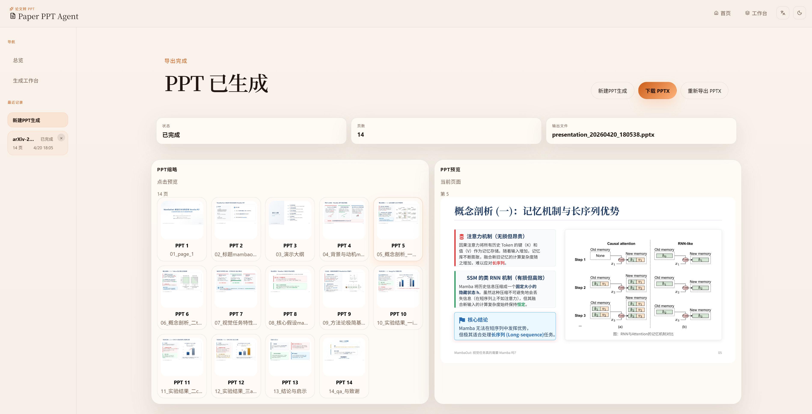

# Paper PPT Agent

中文 | [English](./README.en.md)

一个本地论文生成 PPT 工具，支持从论文 PDF 或 TeX 源码生成可编辑的 PowerPoint。



## 主要能力

- 支持论文 `PDF` 与 `TeX` 源输入
- 推荐优先上传完整的 `TeX` 源码压缩包
- 生成可编辑的 `PPTX`
- 支持反馈优化：生成完成后可单独指定某一页或多页进行修改
- 如需大改，也可允许结构调整，包括增删页、插页和重排

## 环境要求

- Python 3.11+
- [uv](https://docs.astral.sh/uv/)
- Node.js 18+ 与 npm
- 至少一种模型提供商的 API Key：
  - OpenAI
  - DeepSeek
  - Anthropic
  - Gemini
  - 自定义BaseURL接口兼容，模型会显著影响生成效果

## 快速开始

1. 如需后端默认配置，可将 `.env.example` 复制为 `.env`
2. 直接启动项目

```powershell
.\start-dev.bat
```

或

3. 安装后端依赖

```powershell
uv sync --locked
```

4. 安装前端依赖

```powershell
cd frontend
npm install
```

5. 启动项目

```powershell
cd ..
.\start-dev.bat
```

6. 打开以下地址

- 后端: [http://127.0.0.1:8000](http://127.0.0.1:8000)
- 前端: [http://127.0.0.1:5173](http://127.0.0.1:5173)

## 手动启动

后端：

```powershell
uv run python -m uvicorn backend.app:app --host 127.0.0.1 --port 8000 --reload --reload-dir backend --reload-include=*.py
```

前端：

```powershell
cd frontend
npm run dev -- --host 127.0.0.1 --port 5173 --strictPort
```

## 测试

后端测试：

```powershell
.\.venv\Scripts\python -m pytest -q
```

前端生产构建：

```powershell
cd frontend
npm run build
```

## 参考与致谢

本项目在产品思路、流程拆分和部分工程实现方式上参考了以下开源项目：

- [PPTAgent](https://github.com/icip-cas/PPTAgent)
- [ppt-master](https://github.com/hugohe3/ppt-master)

如果你准备将当前仓库公开发布，建议保留上述引用，并进一步核对相关上游项目的许可证要求，确保说明、署名和兼容性处理完整。
